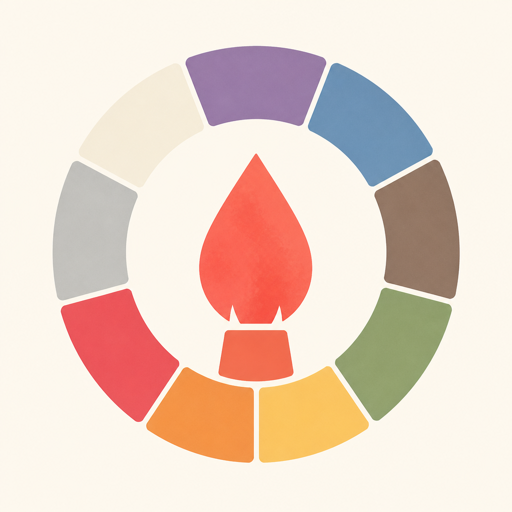

<p align="center">
  
</p>

<h1 align="center">Creative Personality Color</h1>

<p align="center">
  <a href="./README.md">English</a> · <a href="./README-CN.md">简体中文</a>
</p>

<p align="center">
  <em>Discover the color that represents your creative soul.</em>
</p>

**Creative Personality Color** is a WeChat Mini Program that maps everyday choices to a curated spectrum of personality hues. Through a short, story-driven quiz, it reveals your dominant creative tone—complete with Chinese traditional color names, precise color values, and a personalized creative portrait.

---

## Highlights

- **Color × Personality** — Nine signature tones (Purple · Blue · Brown · Green · Yellow · Orange · Red · Gray · White), each embodying a distinct creative temperament
- **Story-driven Assessment** — Nine situational questions that feel like scenes, not a clinical survey
- **Traditional Color Library** — Hundreds of carefully curated Chinese color names with RGB & CMYK values
- **Personalized Narrative** — Tailored copy across life style, creative energy, and artistic kinship
- **Instant Share-ready Result** — A vivid ending page designed for screenshots and social sharing

---

## How It Works

```
Input Name → Answer 9 Scenarios → Aggregate Color Weights → Dominant Tone → Personalized Portrait
```

1. Enter your name to begin the journey  
2. Respond to nine everyday creative scenarios  
3. Each choice contributes weight toward related color tones  
4. The system determines your dominant creative color  
5. Receive a full portrait: tone description, color swatch (RGB / CMYK), and narrative insights  

---

## Color Spectrum

| Tone | Creative Archetype |
|------|--------------------|
| **Purple** | Noble, elegant, blooming with presence |
| **Blue** | Independent, rational, clear-eyed judgment |
| **Brown** | Grounded, serene, at home in one’s own world |
| **Green** | Earth-minded, peaceful, harmony-seeking |
| **Yellow** | Joyful, confident, forever in major key |
| **Orange** | Warm, candid, a small sun for others |
| **Red** | Passionate, bold, endlessly self-assured |
| **Gray** | Understated, steady, quietly resolute |
| **White** | Dreamlike, pure, softly radiant |

---

## Tech Stack

| Layer | Choice |
|-------|--------|
| Runtime | WeChat Mini Program |
| Language | JavaScript |
| State | Local storage (`wx.setStorage`) |
| Assets | Native WXML / WXSS + image resources |

---

## Project Structure

```
personalityTest/
├── app.js                 # Application entry & global data
├── app.json               # Page routing & window config
├── app.wxss               # Global styles
├── project.config.json    # WeChat DevTools project config
├── img/                   # Question & start visuals
├── utils/
│   └── util.js            # Aggregation & random helpers
└── pages/
    ├── start/             # Welcome & name input
    ├── question[1–9]/     # Scenario quiz pages
    ├── end/               # Result & personality portrait
    └── color/             # Color library, tones & narratives
```

---

## Getting Started

### Prerequisites

- [WeChat Developer Tools](https://developers.weixin.qq.com/miniprogram/dev/devtools/download.html)
- A WeChat Mini Program AppID (test AppID is fine for local preview)

### Run Locally

1. Clone this repository  
   ```bash
   git clone https://github.com/<your-org>/personalityTest.git
   cd personalityTest
   ```
2. Open **WeChat Developer Tools** → **Import Project**  
3. Select this directory and fill in your AppID  
4. Compile and preview on simulator or real device  

---

## Customization

| Goal | Where to look |
|------|----------------|
| Questions & options | `pages/question*/` |
| Color → personality mapping | Answer handlers in each question page |
| Tone descriptions | `pages/color/tone.js` |
| Color swatches (RGB / CMYK) | `pages/color/{purple,blue,...}.js` |
| Narrative copy | `pages/color/about.js` |
| Result composition | `pages/end/end.js` |

---

## Philosophy

Color is not decoration—it is a language of temperament.  
This project treats palette as personality: a lightweight, delightful way to turn intuition into a shareable creative identity.

---

## License

This project is provided as-is for learning, inspiration, and creative experimentation.  
Feel free to fork, adapt, and reimagine—attribution appreciated.

---

<p align="center">
  <sub>Made for creators who see the world in color.</sub>
</p>
